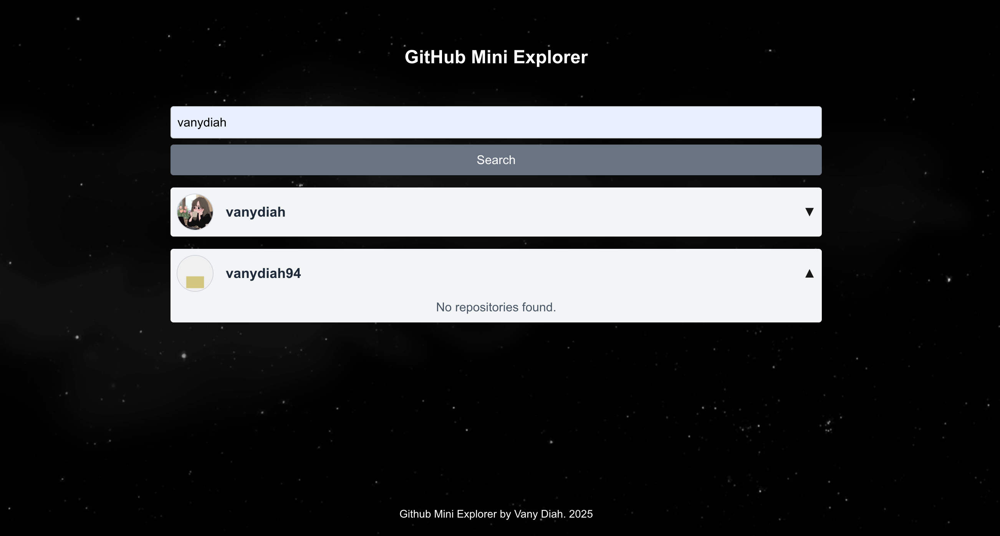

## Github Mini Explorer
GitHub Mini Explorer is a simple React-based tool that lets you search for up to 5 GitHub users by username and view all their public repositories in collapsible dropdowns. It offers a clean UI, responsive design, and smooth UX with loading states and error handling.

## Demo
👉 [GitHub Mini Explorer on Vercel](https://github-mini-explorer.vercel.app/)

## Screenshots





### Getting Started

This is a [Next.js](https://nextjs.org) project bootstrapped with [`create-next-app`](https://nextjs.org/docs/app/api-reference/cli/create-next-app).

First, run the development server:

```bash
npm run dev
# or
yarn dev
# or
pnpm dev
# or
bun dev
```

Open [http://localhost:3000](http://localhost:3000) with your browser to see the result.

You can start editing the page by modifying `app/page.tsx`. The page auto-updates as you edit the file.

This project uses [`next/font`](https://nextjs.org/docs/app/building-your-application/optimizing/fonts) to automatically optimize and load [Geist](https://vercel.com/font), a new font family for Vercel.

### Requirements checklist
- Use React ✅

- Use TypeScript ✅

- You may use other libraries of your choice for forms, styling, testing, state management, etc. ✅
Form validation using react-hook-form & Zod, styling with TailwindCSS, testing with Jest

- The app must be available as a public GitHub repository ✅

- The app should be hosted and publicly accessible by URL (i.e. via GitHub pages) ✅
Deployed on Vercel

- A proper README must be provided ✅

- Errors should be handled appropriately ✅

- Good UX practices should be implemented (i.e. keyboard events handling, loading states) ✅

- Only English should be used ✅

Nice to Have
- Unit and integration tests ✅
check by run this
```bash
npm run test
# or
yarn test
# or
pnpm test
# or
bun test
```


Tips

- Don’t forget about the mobile view, ✅

<p align="left">
  
  
  
  
  
</p>

